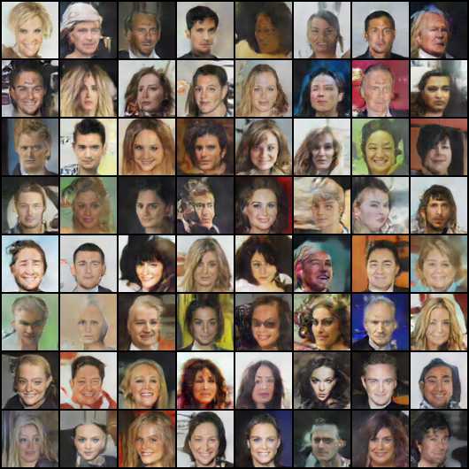
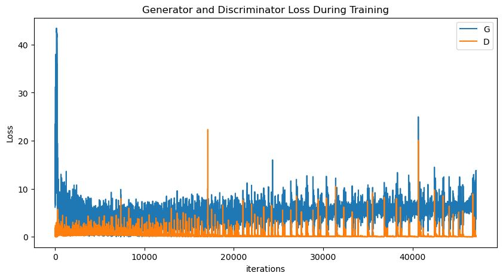
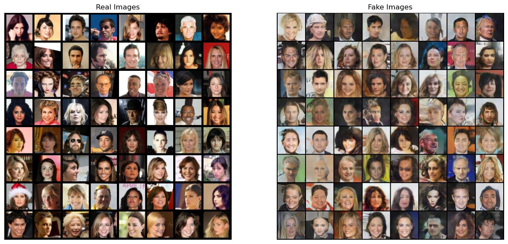

# DCGAN-to-generate-faces
Program in python to generate faces with DCGAN extension of GAN 

## GAN to generate faces.

A GAN (Generative Adversarial Network) is a type of artificial intelligence algorithm invented by Ian Goodfellow in 2014. The main focus of GAN is to generate data from scratch, mainly for generating images.
GANs are models of two neural networks that compete with each other to be more accurate in their predictions. The two neural networks that make up a GAN are the generator and the discriminator. The main job of the discriminator is to look at images and show whether it is a real image or a fake image produced by the generator. Therefore, the job of the generator, as its name suggests, is to generate "fake" images that look like real images. 

In the program we use the dataset of celeb_a, using 20,000 celebrity images and 300 epoch, and the result of the code were:

  

This animation, we can se all the images that create the algorithm in a gif.

 

  

This image is the last image of the code process

  

This graph represents the losses of the generator and the discriminator

  

Finally this image shows the real images vs the false images that the code performs

